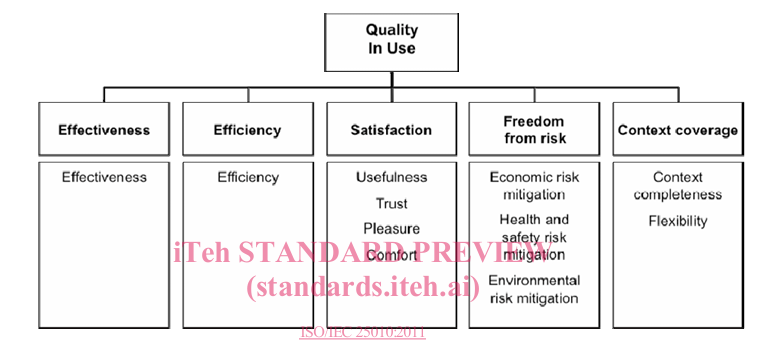
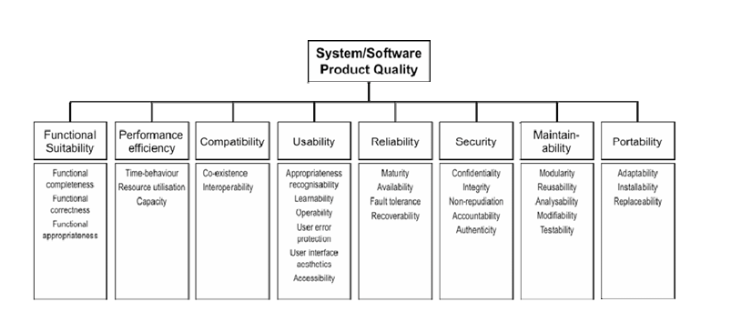

# Critério 4 — Modelo de qualidade (adaptação + representação gráfica)

## 1. Contexto da norma ISO/IEC 25010

O modelo de qualidade utilizado nesta avaliação está fundamentado na norma [ISO/IEC 25010](https://cdn.standards.iteh.ai/samples/35733/2ca18b477b7845a5b8cae39d6de0c098/ISO-IEC-25010-2011.pdf), integrante da série **SQuaRE (Systems and software Quality Requirements and Evaluation)**, que substituiu e expandiu o antigo modelo.  

A norma define dois modelos complementares:

- **Modelo de qualidade em uso**, composto por cinco características: efetividade, eficiência, satisfação, liberdade de risco e cobertura de contexto.  

 Figura 1 -  Modelo de qualidade de produto

  

- **Modelo de qualidade do produto**, composto por oito características principais: adequação funcional, eficiência de desempenho, compatibilidade, usabilidade, confiabilidade, segurança, manutenibilidade e portabilidade. 

 Figura 2 - Modelo de qualidade do produto

  

- O modelo pode ser aplicado tanto a produtos de software isolados quanto a sistemas computacionais que incluem software, hardware e dados associados. Entretanto, a própria norma admite que nem todas as características precisam ser especificadas ou medidas em todos os contextos, sendo possível realizar uma **adaptação (*tailoring*)**, desde que as justificativas sejam documentadas e mapeadas em relação ao modelo original.

## Nosso Produto:

No caso do **Guardiões da Saúde**, classificado como um **Sistema de Informação em Saúde** voltado para **vigilância epidemiológica participativa**, optamos por priorizar as características **Adequação Funcional** e **Segurança**, por refletirem de forma mais direta as necessidades dos stakeholders e os riscos associados ao domínio da saúde pública.

---

## 2. Adequação Funcional

A **Adequação Funcional (Functional Suitability)**, conforme o ISO/IEC 25010, refere-se à *“capacidade do sistema de fornecer funções que satisfaçam as necessidades explícitas e implícitas quando utilizado em condições específicas”*

Essa característica subdivide-se em três subcaracterísticas:

- **Completude Funcional (Functional Completeness):** presença de todas as funções necessárias ao atendimento dos requisitos.  
- **Corretude Funcional (Functional Correctness):** fornecimento de resultados corretos, de acordo com a precisão exigida.  
- **Adequação Funcional (Functional Appropriateness):** funções que apoiam de forma eficaz a realização de tarefas específicas.  

No contexto do **Guardiões da Saúde**, essas dimensões são diretamente associadas a requisitos de confiabilidade epidemiológica:

- Para o **cidadão**, asseguram que o aplicativo contemple todas as funções necessárias ao relato de sintomas (completude), forneça feedback correto sobre o registro (corretude) e ofereça uma interface adequada ao propósito da vigilância participativa (adequação).  
- Para o **gestor de saúde pública** e para o **pesquisador/epidemiologista**, garantem que os dados coletados sejam completos, corretos e apropriados para embasar decisões estratégicas e análises científicas.  

---

## 3. Segurança

A **Segurança (Security)**, que no modelo anterior figurava como subcaracterística da funcionalidade, foi elevada no **ISO/IEC 25010** à condição de característica autônoma, composta pelas subcaracterísticas:

- **Confidencialidade (Confidentiality):** proteção contra acesso não autorizado a dados e funções.  
- **Integridade (Integrity):** prevenção contra modificações não autorizadas ou perda de consistência.  
- **Não-repúdio (Non-repudiation):** garantia de que ações ou transações realizadas não podem ser negadas posteriormente.  
- **Autenticidade (Authenticity):** verificação da identidade de usuários ou sistemas.  
- **Responsabilidade (Accountability):** capacidade de rastrear ações realizadas por indivíduos ou sistemas.  

No **Guardiões da Saúde**, essas subcaracterísticas respondem a exigências legais e sociais:

- Para o **cidadão**, representam a garantia de privacidade e proteção de dados sensíveis de saúde, em conformidade com a **Lei Geral de Proteção de Dados (Lei nº 13.709/2018)**.  
- Para o **gestor do SUS** e o **pesquisador**, asseguram a integridade e rastreabilidade da informação, condição indispensável para a tomada de decisões e para a produção científica confiável.  
- Para o **administrador do sistema** e a **ProEpi**, possibilitam a implementação de mecanismos de autenticação robustos, auditoria de acessos e rastreabilidade de incidentes de segurança.  

---

## Referências Bibliográficas

1. INTERNATIONAL ORGANIZATION FOR STANDARDIZATION. *ISO/IEC 25010:2011 — Systems and software engineering — Systems and software Quality Requirements and Evaluation (SQuaRE) — System and software quality models*. Geneva: ISO, 2011. Disponível em: <https://cdn.standards.iteh.ai/samples/35733/2ca18b477b7845a5b8cae39d6de0c098/ISO-IEC-25010-2011.pdf>. Acesso em: 30 set. 2025.  

2. INTERNATIONAL ORGANIZATION FOR STANDARDIZATION. *ISO/IEC 25010:2023 — Systems and software engineering — Systems and software Quality Requirements and Evaluation (SQuaRE) — System and software quality models*. Geneva: ISO, 2023. Disponível em: <https://www.iso.org/standard/78176.html>. Acesso em: 30 set. 2025.  

3. ONE DAY TESTING. *ISO/IEC 25010 e a qualidade de software*. Blog One Day Testing, 2023. Disponível em: <https://blog.onedaytesting.com.br/iso-iec-25010/>. Acesso em: 30 set. 2025.  

4. ARC42. *Quality Model — Update on ISO 25010, version 2023*. Quality.arc42.org, 2023. Disponível em: <https://quality.arc42.org/articles/iso-25010-update-2023>. Acesso em: 30 set. 2025.  

---

## Histórico de Versões

| Versão | Data       | Descrição                          | Autor                                                         | Revisor |
|:------:|:-----------|:-----------------------------------|:--------------------------------------------------------------|:-------:|
| 1.0    | 28/09/2025 | Criação do documento inicial       | [Oscar de Brito](https://github.com/OscarDeBrito)             |   —     |
| 1.1    | 30/09/2025 | Adição de referências bibliográficas | Fernanda Vaz                                                  |   —     |
